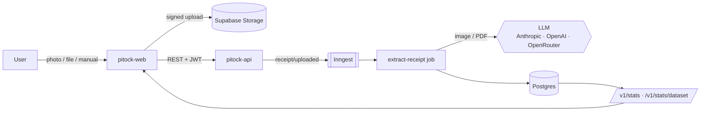

<div align="center">

# 🧾 pitock-api

**The backend of Pitock — collect receipts, extract them with an LLM, turn them into spending insights.**

_Pitock_ (from Piedmontese _pitòch_, "stingy") is a personal finance tool for people who want to know exactly where their grocery money goes.


[Web app → `pitock-web`](https://github.com/pitock/pitock-web) · [API contract → `openapi.json`](./openapi.json) · [Metrics → `pitock-web` README](https://github.com/pitock/pitock-web#-metrics--how-they-are-computed)

</div>

---

## ✨ Why this project exists

> [!NOTE]
> **Pitock is an experiment in agentic coding applied to a real problem of mine.**
>
> I kept paper receipts in a drawer and had no idea how much I spent, where, and whether
> the same product cost less in another shop. Instead of writing the app line by line, I used it
> as a testbed: **two AI coding agents** (one for this backend, one for the [web app](https://github.com/pitock/pitock-web))
> built the whole system in parallel, milestone by milestone, from a written specification.
>
> My role was the one of a tech lead: write the spec, define the acceptance criteria, review
> the decisions, test the result on my own receipts and steer the corrections.

How the experiment was set up:

| Piece                 | What it did                                                                                                                                                                   |
| --------------------- | ----------------------------------------------------------------------------------------------------------------------------------------------------------------------------- |
| **Specification**     | One source-of-truth document per repository: product, stack, data model, API contract, security rules, milestones with acceptance criteria.                                   |
| **Milestones**        | Backend `B0 → B5`, frontend `F0 → F6`, then a final `SYNC` to align the frontend with the real contract. Each milestone ran in a fresh agent session.                         |
| **Autopilot**         | A shell orchestrator ran both agents unattended, resumed after usage limits and skipped milestones already done.                                                              |
| **Review sub-agents** | `test-runner`, `security-reviewer`, `contract-checker` (and `ux-reviewer` on the web) had to be green before a milestone could be marked done.                                |
| **Guardrails**        | Deny-list of commands (no `sudo`, no `git push`, no deploy CLIs, no access outside the project), no real external services during autopilot: PGlite, fakes and mocks instead. |
| **Decision log**      | Every choice not covered by the spec was written down with date and reason, so a human could audit it later.                                                                  |

Everything that needed real accounts (Supabase, Vercel, Inngest, LLM keys) was left as a
"manual to-do" list and done by me afterwards.

---

## 🧭 What it does



- **Three ways in**: `camera`, `file` (images or PDF, many at once) and `manual` (form data _is_ the extraction).
- **Raw first**: the original file is always stored and never modified; every extraction points to it with a foreign key and keeps a full history.
- **LLM extraction** with a Zod schema: merchant, VAT number, date, total, taxes, payment method, category and every line item with normalized name, brand and pack size.
- **Bring your own key (BYOK)**: use the platform model with a monthly quota, or your own Anthropic / OpenAI / OpenRouter key (AES-256-GCM encrypted, only `last4` ever returned), with optional fallback to the platform.
- **Usage tracking**: every LLM call is logged with tokens, model, provider, key source and cost.
- **Statistics** ready for the dashboard, plus a flat dataset of receipts and items for the price analytics computed in the browser.

---

## 🚀 Quick start

**Requirements:** Node.js 24 LTS, pnpm 12 (`corepack enable`).

```sh
pnpm install
cp .env.example .env     # fill in what you need
pnpm dev                 # → http://localhost:8787/health
```

In development and test the server starts even without `DATABASE_URL` or secrets.
With `NODE_ENV=production` every variable in `REQUIRED_IN_PRODUCTION` (`src/config/env.ts`) is mandatory.

### Full local pipeline (real extraction)

```sh
# .env → INNGEST_DEV=1, DATABASE_URL, SUPABASE_*, DEFAULT_MODEL, PLATFORM_API_KEY
pnpm db:migrate           # Drizzle migrations + RLS, policies and private bucket
pnpm dev                  # terminal 1
pnpm inngest:dev          # terminal 2 — Inngest Dev Server on /api/inngest
pnpm simulate:upload fixtures/receipts   # terminal 3 — behaves like the web app
```

`simulate:upload` also needs `SIMULATE_EMAIL`, `SIMULATE_PASSWORD`, `SUPABASE_URL` and `SUPABASE_ANON_KEY`.
Want a populated dashboard right away? `pnpm seed:demo` creates a demo user with one year of spending.

---

## ⚙️ Configuration

| Variable                                                  | Purpose                                                                   |
| --------------------------------------------------------- | ------------------------------------------------------------------------- |
| `ALLOWED_ORIGINS`, `ALLOWED_ORIGIN_REGEX`                 | CORS: exact origins and a regex for preview deployments                   |
| `SUPABASE_URL`, `SUPABASE_SERVICE_ROLE_KEY`               | Storage and account deletion (server only)                                |
| `SUPABASE_JWKS_URL`, `SUPABASE_JWT_ISSUER`                | Verify user access tokens                                                 |
| `DATABASE_URL`                                            | Postgres connection string (Supabase pooler)                              |
| `KEY_ENCRYPTION_SECRET`                                   | 32-byte base64 master key for BYOK encryption (`openssl rand -base64 32`) |
| `DEFAULT_PROVIDER`, `DEFAULT_MODEL`, `PLATFORM_API_KEY`   | Platform model (must accept images and PDF)                               |
| `PLATFORM_MONTHLY_RECEIPT_LIMIT`                          | Free extractions per user per month on the platform key                   |
| `MAX_UPLOAD_BYTES`                                        | Upload size limit                                                         |
| `INNGEST_EVENT_KEY`, `INNGEST_SIGNING_KEY`, `INNGEST_DEV` | Background jobs                                                           |
| `CRON_SECRET`                                             | Bearer token for the daily stats cron                                     |

See [`.env.example`](./.env.example) for the full list with comments.

---

## 📜 Scripts

| Script                                 | What it does                                                |
| -------------------------------------- | ----------------------------------------------------------- |
| `pnpm dev`                             | Local server on `:8787` (reads `.env`)                      |
| `pnpm build`                           | Compile to `dist/`                                          |
| `pnpm lint` / `pnpm format`            | ESLint + Prettier check / write                             |
| `pnpm typecheck`                       | `tsc --noEmit`                                              |
| `pnpm test`                            | Unit tests (Vitest)                                         |
| `pnpm test:integration`                | Integration tests on PGlite (in-memory Postgres, no Docker) |
| `pnpm db:generate` / `pnpm db:migrate` | Generate / apply migrations                                 |
| `pnpm openapi:export`                  | Write the contract to `openapi.json`                        |
| `pnpm inngest:dev`                     | Inngest Dev Server                                          |
| `pnpm simulate:upload <path>`          | Upload files or folders as the web app would                |
| `pnpm seed:demo`                       | Demo user with one year of receipts                         |

---

## 🔌 API at a glance

All `/v1/*` routes need `Authorization: Bearer <Supabase access token>`. The complete, typed
contract is served at `GET /openapi.json` (OpenAPI 3.1) and committed as [`openapi.json`](./openapi.json):
the web app generates its TypeScript types from it.

| Area        | Endpoints                                                                                                                                                                                                                                                                                                           |
| ----------- | ------------------------------------------------------------------------------------------------------------------------------------------------------------------------------------------------------------------------------------------------------------------------------------------------------------------- |
| Health      | `GET /health` · `GET /openapi.json` (public)                                                                                                                                                                                                                                                                        |
| Profile     | `GET /v1/me` · `DELETE /v1/account` (body `{ "confirm": "ELIMINA" }`)                                                                                                                                                                                                                                               |
| Receipts    | `POST /v1/receipts/upload-url` → signed upload URL (`409 DUPLICATE` on same SHA-256) · `POST /v1/receipts/{id}/complete` · `POST /v1/receipts/manual` · `GET /v1/receipts` (cursor pagination, filters) · `GET/DELETE /v1/receipts/{id}` · `GET /v1/receipts/{id}/extractions` · `POST /v1/receipts/{id}/reextract` |
| Extractions | `PATCH /v1/extractions/{id}` — manual correction, creates a new current version                                                                                                                                                                                                                                     |
| AI settings | `GET/PUT /v1/settings/ai` · `PUT/DELETE /v1/settings/ai/keys/{provider}` · `GET /v1/settings/ai/models?provider=` · `POST /v1/settings/ai/test`                                                                                                                                                                     |
| Usage       | `GET /v1/usage` · `GET /v1/usage/calls`                                                                                                                                                                                                                                                                             |
| Stats       | `GET /v1/stats?from&to&granularity=month\|year` · `GET /v1/stats/dataset?from&to`                                                                                                                                                                                                                                   |

Example:

```sh
curl -H "Authorization: Bearer $TOKEN" \
  "http://localhost:8787/v1/stats?from=2026-01-01&to=2026-06-30&granularity=month"
```

---

## 🤖 Extraction pipeline

1. `POST /v1/receipts/{id}/complete` sends the Inngest event `receipt/uploaded` with ids only (never keys or file contents).
2. `extract-receipt` moves the receipt to `processing` and asks the **AI router** for provider, model and key:
   platform (if under quota) or BYOK, with optional fallback when the user key fails for auth or quota.
3. Very tall receipt photos are cut into overlapping vertical tiles (max 10) so providers do not downscale them into unreadable images.
4. The model is called with `generateText` + Zod structured output, with one retry on invalid output.
5. **Post-processing** normalizes the result and lowers confidence when the numbers do not add up (see below).
6. Extraction, line items and `llm_usage` are written in **one transaction**. The receipt ends `extracted`, or `failed` with an `errorCode`.
7. A `stats/recompute` event refreshes the monthly aggregates.

```
pending_upload → uploaded → processing → extracted
                                      ↘ failed (errorCode)
```

---

## 📐 Server-side metrics

The heavy analytics (forecast, savings, price comparisons) live in the browser and are
documented in the [web README](https://github.com/pitock/pitock-web#-metrics--how-they-are-computed).
The backend owns the foundations they rely on.

**Receipt date.** Every receipt $r$ is placed in time by

$$
d(r) = \operatorname{coalesce}\big(\text{purchasedAt}(r),\ \text{createdAt}(r)\big)
$$

and grouped by period in the `Europe/Rome` time zone (`YYYY-MM` or `YYYY`). Only receipts with
status `extracted` and their **current** extraction count. Ranges are `[from, to)`; a date-only
`to` covers the whole day.

**Totals.** For the set $R$ of receipts in range, with total $t_r$:

$$
\text{total} = \sum_{r \in R} t_r \qquad n = |R| \qquad \text{average} = \begin{cases} \dfrac{\text{total}}{n} & n > 0 \\ 0 & n = 0 \end{cases}
$$

The same sum is split by category (unknown categories fold into `altro`), by period, by source
and by merchant (top 10). All amounts are rounded to 2 decimals; no currency conversion.

**Extraction consistency check.** With line amounts $a_i$ and printed total $T$:

$$
\Big|\sum_i a_i - T\Big| > 0.05 \;\Rightarrow\; \text{confidence} \leftarrow \min(\text{confidence},\ 0.5)
$$

and a note explains the mismatch, so the user knows which receipts to double-check.

**Merchant harmonization.** The same shop printed as `IN'S SUPERMERCATO`, `IN's supermercato` or
`Lidl Italia S.r.l.` / `LIDL` becomes one merchant:

- a normalized key (lowercase, no accents, no punctuation, no legal form such as `srl`/`spa`) merges identical names;
- an Italian VAT number merges only if its **check digit is valid** _and_ the names are compatible:
  shared words $s$ satisfy $s = \min(|A|, |B|)$ or $s / \max(|A|, |B|) \ge 0.5$;
- groups are built with union-find; the display name prefers the brand, then mixed case, then the most frequent spelling.

Names are harmonized over the user's **whole** history, so the same shop has the same name in any period.

**LLM cost.** For a call with $x$ input and $y$ output tokens and prices per million tokens $p_{in}, p_{out}$:

$$
\text{cost}_{USD} = \frac{x \cdot p_{in} + y \cdot p_{out}}{10^6}
$$

using the stored `cost_usd` when present, else the current price in `model_prices` (calls without any price are reported as `unpricedCalls`).
**Platform quota**: platform extractions since the 1st of the month (Europe/Rome) must stay below `PLATFORM_MONTHLY_RECEIPT_LIMIT`.

**Pre-aggregates.** `stats_monthly` (month × category) is rewritten by the Inngest function
`recompute-stats` after every extraction, correction, manual entry or deletion, and by a daily
Vercel cron (`03:00 UTC`, `GET /cron/recompute-stats`). A Postgres advisory lock serializes concurrent recomputes per user.

---

## 🏗️ Architecture

```
src/
├─ app.ts              middleware chain + routes
├─ container.ts        createContainer(env) → real adapters · buildContainer(env, infra) → services (also for tests)
├─ modules/            routes → services → repositories (feature folders)
│  ├─ receipts/  extraction/  ai/  settings/  usage/  stats/  account/
├─ ports/              interfaces: storage, LLM, model catalog, queue, clock, user admin
├─ infra/              Postgres (Drizzle), Supabase Storage, Inngest, Vercel AI SDK, crypto
├─ jobs/               extract-receipt, recompute-stats
├─ middleware/         request id, redacting logger, secure headers, CORS, auth, rate limit, errors
└─ shared/             dates (Europe/Rome), errors, OpenAPI helpers, pagination
```

- **Hexagonal-ish**: services only see ports, so tests swap Postgres for PGlite and providers for fakes.
- **Only repositories run queries**, and every query is filtered by `userId`.
- **Database**: Drizzle schema in `src/infra/db/schema/`, migrations in `drizzle/`.
  `drizzle/supabase/0000_rls_and_storage.sql` (hand-written) enables RLS, creates the policies and the private `receipts` bucket.

## 🔒 Security

- JWTs verified against Supabase JWKS; CORS allow-list; secure headers; per-route rate limits.
- BYOK keys: AES-256-GCM, random 12-byte IV, `key_version` for rotation; plaintext exists only in memory during the call — never in logs, responses or events.
- Logs redact tokens and keys; storage access only through short-lived signed URLs.
- Account deletion removes files, rows and the Auth user; every step is idempotent and can be retried.

## ☁️ Deploy (Vercel)

1. Create a Vercel project linked to this repository (framework **Hono**, entry `src/index.ts`).
2. Set the environment variables from `.env.example`, including `CRON_SECRET`.
3. Run `pnpm db:migrate` against the production database.
4. Deploy and check `https://<domain>/health`.

The daily cron is declared in [`vercel.json`](./vercel.json).

---

## 📄 License

Released under the [MIT License](./LICENSE) © 2026 Michele Cocca.
